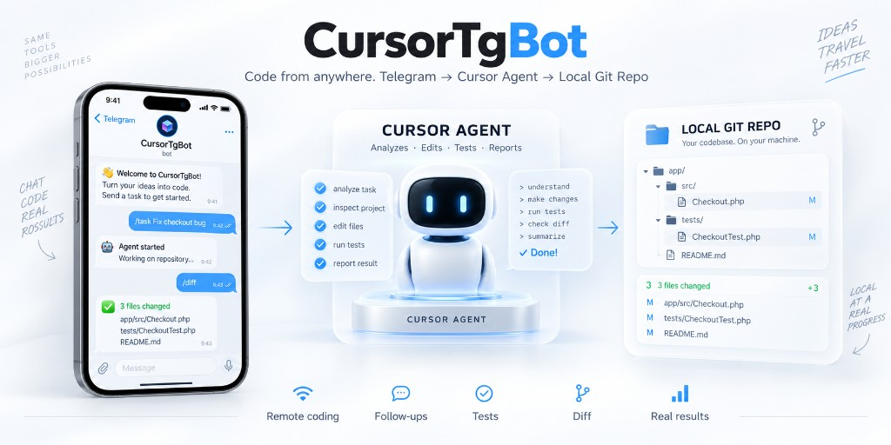

# Cursor Telegram Bot



Long-running Telegram bot that forwards messages to a **Cursor SDK local agent**. Each allowed user can drive coding tasks against a target git repository on the same machine.

No public webhook — the bot uses Telegram long polling.

## Requirements

- Python 3.11+
- A [Cursor](https://cursor.com) account with an API key
- A Telegram bot token from [@BotFather](https://t.me/BotFather)
- A local git repository for the agent to work in (`REPO_CWD`)

## Installation

```bash
git clone https://github.com/starline/CursorTgBot.git
cd CursorTgBot

python3 -m venv .venv
source .venv/bin/activate   # Windows: .venv\Scripts\activate
pip install -r requirements.txt

cp .env.example .env
```

Edit `.env` and set at least:

| Variable | Description |
|----------|-------------|
| `TELEGRAM_BOT_TOKEN` | Token from BotFather |
| `ALLOWED_USER_IDS` | Your Telegram user id(s), comma-separated (can be empty on first run to discover the id) |
| `CURSOR_API_KEY` | Cursor API key (Dashboard → API Keys) |
| `REPO_CWD` | Absolute path to the target git repo |

Optional:

| Variable | Description |
|----------|-------------|
| `ALLOWED_CHAT_IDS` | Restrict to specific group/supergroup ids (empty = any chat, still filtered by user) |
| `FORUM_MODE` | `1` to use Telegram forum topics |
| `FORUM_CHAT_ID` | Supergroup id with Topics enabled |
| `CURSOR_MODEL` | Model id (default in example: `auto`) |
| `BOT_DATA_DIR` | Session/DB directory (default: `./data`) |

To get your Telegram user id: start the bot and send any message (or `/info`). If you are not allowlisted yet, the bot replies with your id — put it in `ALLOWED_USER_IDS` and restart. In a group, send `/info` to get the chat id for `ALLOWED_CHAT_IDS` / `FORUM_CHAT_ID`.

## Run

```bash
./run.sh
# or:
source .venv/bin/activate && python -m bot
```

Keep the process running (systemd, `tmux`, etc.). The agent needs network access to Cursor and write access to `REPO_CWD`.

## Usage

### Private chat

1. Start a chat with your bot.
2. Send `/task <what you want done>` to start an agent run.
3. Use `/ask <follow-up>` (or plain text) for follow-ups in the same session.

### Forum mode (topics)

Enable with `FORUM_MODE=1` and set `FORUM_CHAT_ID` (or a single `ALLOWED_CHAT_IDS` entry). The bot must be a **group admin** with permission to **manage topics**.

| Action | Behaviour |
|--------|-----------|
| `/task …` | Creates a **new** forum topic (name = start of the prompt) and runs the agent there |
| Text or `/ask …` **inside** a topic | Follow-up on that topic’s agent session |
| Text in General | Ignored (use `/task`) |

Session key = `(chat_id, thread_id)` → one Cursor agent session per topic.

### Commands

| Command | Action |
|---------|--------|
| `/task <text>` | New task (new topic if forum mode is on) |
| `/ask <text>` | Follow-up in the current topic/chat |
| `/info` | Chat/group id, forum flags, thread id |
| `/status` | Idle / running / queue |
| `/cancel` | Cancel the current run |
| `/diff` | `git status` + `git diff --stat` in `REPO_CWD` |
| `/new` | Drop the agent session for this topic/chat |
| `/phpunit [args]` | Runs `bash ./scripts/phpunit.sh …` in `REPO_CWD` (if present) |
| `/phpstan [args]` | Runs `bash ./scripts/phpstan.sh …` in `REPO_CWD` (if present) |

Only one agent **run** is active at a time (global queue). The agent will not commit or push unless you ask for that in the prompt.

## Security

- Only users listed in `ALLOWED_USER_IDS` can use the bot.
- Optionally restrict chats with `ALLOWED_CHAT_IDS`.
- The local Cursor SDK runs tools **without IDE approval prompts** — treat this bot like shell access to `REPO_CWD`.
- Never commit `.env`. Keep the repo private if your deployment details are sensitive, or rotate keys if they leak.

## Project layout

```
CursorTgBot/
├── bot/           # Telegram handlers + Cursor agent runner
├── data/          # Local session store (gitignored)
├── .env.example   # Template for configuration
├── requirements.txt
└── run.sh
```
